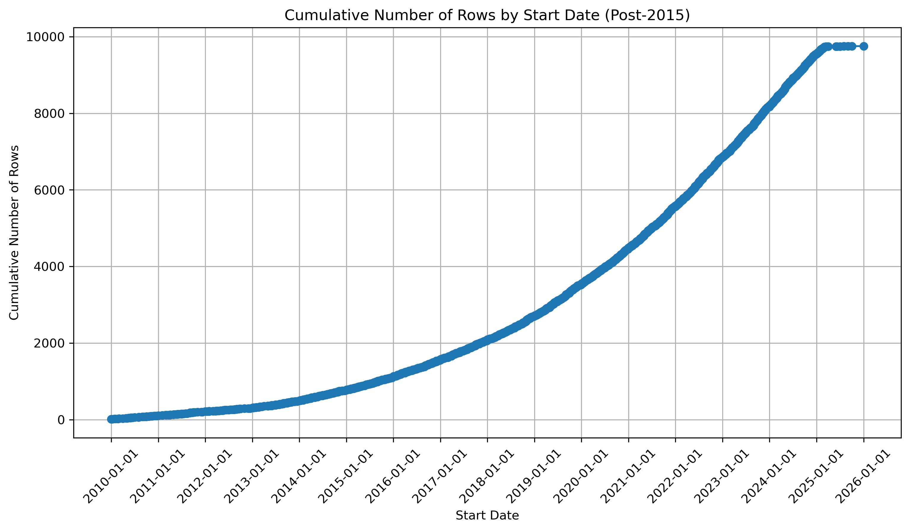

## Analyzing the AEA RCT Registry

### Start Date of Exp.



### Where are the experiments taking place?

```
Country
United States of America                                       0.223356
Germany                                                        0.078851
India                                                          0.058889
China                                                          0.038816
United Kingdom of Great Britain and Northern Ireland           0.031163
                                                                 ...   
Azerbaijan                                                     0.000111
India, Norway                                                  0.000111
Germany, Denmark, Estonia, Spain, Finland, Italy, Lithuania    0.000111
Serbia, Turkey, Ukraine                                        0.000111
Netherlands, United States of America                          0.000111
```

### Sample size

```
count         5,657.00
mean        182,168.00
std       6,577,887.00
min               1.00
25%             499.00
50%           1,280.00
75%           3,543.00
max     372,000,000.00
```

Many of the ones < 50 are coding errors so the average sample size is pretty healthy.
